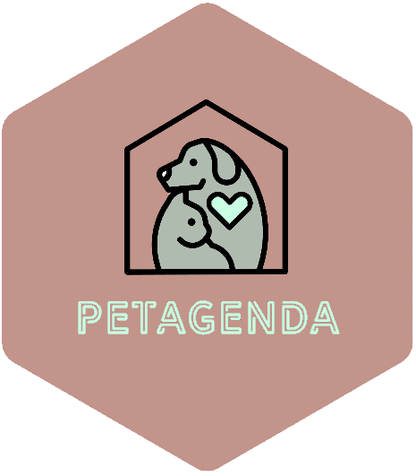

# PETAGENDA

# What is PETAGENDA?

**PETAGENDA is a pet-care app developed for co-parents and dog sitters alike. Petagenda seeks to relieve the anxiety of pet parenting by providing users with a pet-care schedule;  keeping pet-parents updated without unnecessary correspondence. Users can create profiles for their pets, schedule tasks, and establish new or temporary owners  that can complete said tasks**

# Built with 

    <a href="https://jestjs.io" target="_blank" rel="noreferrer">    <a href="https://nodejs.org" target="_blank" rel="noreferrer">  

Breed images - "https://www.flaticon.com/free-icons/"
